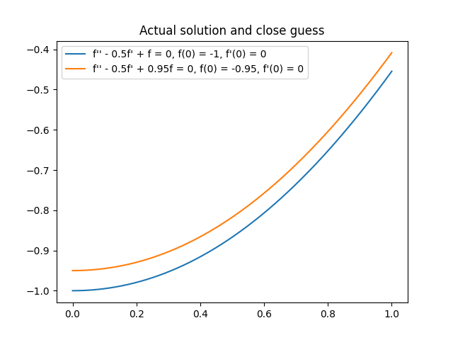
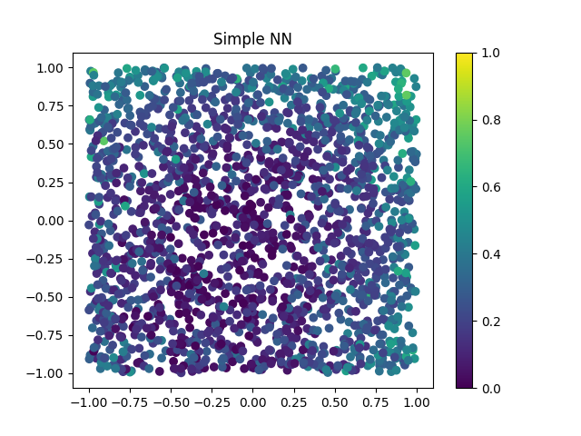

# Introduction

During my last week of vacation this March I wanted to improve my skills a little bit and work a bit deeper on a machine learning problem using neural networks since I had not done that in a while. I also wanted to learn a bit of pytorch since I had always used tensorflow in the past.

So I thought I would revisit an old problem that I like, which is to approximate a time series by the solution of an homogeneous differential equation with constant coefficient, to see how ML could be used to tackle that problem.

For this work I didn't care too much about the state of the art or code quality, I just wanted to push myself a bit on getting actual results with Pytorch and a neural-network based approach.

# Problem Statement

For this work we are going to restrict a bit the problem to make the study last only a few days. What we are going to attempt to solve is:

Given an integer N, the order of our differential equation,
Given a time series T where,
 - The X values are a thousand points ranging from 0 to 1,
 - The Y values are the solution of a homogeneous differential equation with constant coefficients in the range [-1, 1] and initial conditions in the range [-1, 1],
Find the N coefficients of the differential equation and the N initial conditions that the time series satisfies.

In this study we will only look at N=2 (for a simple case where we can interpret the results) and N=5 (for a more challenging case).

With an example, given the following time series:

I would need to find that it satisfies the equation:

If you are curious, the analytic solution is:

This clearly a synthetic problem, and while it could have some use cases in pratice what I like in this problem is that it is rather difficult but easy to produce data for.

The reason why I am restricting the problem to [0, 1] is that it simplifies the code and likely doesn't lose generality. The reason why I am restricting coefficients to [-1, 1] is because the solutions of our equation can follow an exponential growth, so if we use large coefficients we will often reach values which cannot be represented with floating point numbers.

> Remember for later that we only use small coefficients in [-1, 1] as it will matter down the line.

Finally, to judge our results we will use look at the MSE "mean squared error" between the real coefficients of the equation and the one we guessed.

# Gathering Training Data

Given a differential equation, we can use a numerical scheme like the ones provided by `scipy.integrate.solve_ivp` to produce its time series.

In a nutshell, the way those solvers work is that they use a more complex version of [euler's integration scheme](https://en.wikipedia.org/wiki/Euler_method) to integrate the diffirential equation and thus compute the time series. The algorithms used are typically variants of the [Runge-Kutta methods](https://en.wikipedia.org/wiki/Runge%E2%80%93Kutta_methods).

Assuming we want to solve the following equation:

We would need to put it in a matrix form for `scipy.integrate.solve_ivp`, which would look like:

Since we have a way to solve the differential equations, we can build a database by drawing random equations (using a uniform distribution of coefficients between -1 and 1) and solving them. In my case I produced 100k equations to train the models, which takes a few minutes on my laptop.

# Direct Approach
First we will attempt to solve the problem naively. We take our time series and we try to find a model which can predict the coefficients.

# Baseline
Since we will have to judge the models later on, we need some baseline to measure if the results from a model are good or not. Ignoring the differential equations for a while, we know that we generated our database by randomly drawing N coefficients and N initial conditions between -1 and 1, so a very simple strategy is to always guess zero (aka the average value) for all of the coeffients.

This will lead to an MSE equal to the variance of the uniform distribution over [0, 1], so `1/12 * (1 - (-1))**2 = 0.3333...`, which I verified experimentally.

Note that if a model cannot guess the relationship between the time series and the coefficients of the ODE, the best guess it can give for the coefficients will be their statistic average, which is the strategy we just described. Said another way:
 - If a model has `MSE > 0.333...` on our problem it means that model is terrible, in the realm of random guessing.
 - If a model has `MSE ~ 0.333...` it means that it has seen our data and sees how they are statistically distributed, but cannot get more information from the time series. In other words, the model doesn't understand the link between the time series and the coeffients and just answers 0 all the time because it is the best statisical guess.
 - If a model has `MSE < 0.333...` it means that the model is finding some information in the time series that it can use to predict the coefficients of the differential equation.

# Using a Solver
As we can use `scipy.integrate.solve_ivp` to compute the solution of a differential equation, one approach to finding the coefficients can be to use a solver, like the ones provided in `scipy.optimize.minimize`. We will simply ask the optimiser to call the ODE solver again and again with different coefficients until it can find the ones which give the correct time series.

Such solvers typically use methods similar to a [gradient descent](https://en.wikipedia.org/wiki/Gradient_descent) to optimize the coefficients, so following the gradient (aka derivate) to find the minimum of the provided function.

To help the solver we would normally provide it with the gradient, the jacobian or hessian of the function to help it minimize the coefficients more efficiently. <sarcasm> I have a very elegant way to compute the gradient of the solution of an ODE by the coeffient of the equation for any order, [unfortunately it doesn't fit in the margin of the page...](https://en.wikipedia.org/wiki/Fermat's_Last_Theorem) </sarcasm>.

Fortunately some optimization algorithms work even without providing a gradient, to my knowledge they will evaluate the provided function multiple time to try and estimate its gradient automatically. They typically require some hypothesis on the functions to work, for instance the function might have to be convex.

Regardless, we can provide our function to the solver and let it run. This process is quite slow because the solver might need several evaluation to improve the coefficients, and each evaluation requires solving an ODE with `scipy.optimize.solve_ivp`.

When used on our database of second-order equations, this approach yields a mean squared error of `MSE = 0.07`. Since this results is obtained by (almost) brute-forcing the ODE solver, I think it is reasonable to consider that this value is the lower bound of the MSE we could hope to achieve with any method. In other words, a model which achieves `MSE = 0.07` on this problem would be pretty much perfect.

One issue with such solvers, especially when they are used without gradient, is that they might not always converge. This is what happens when I try it on ODEs of order 5, the solver just gives up without proposing any coefficients, which is fair given that we are giving it a rather hard problem and no clues on how to solve it.

In conclusion, using a solver for this problem is very slow but for simpler versions of the problem it can give exact results. For harder versions (higher order ODEs) the solver gives up, so it cannot be used, at least not without a gradient.

# Pytorch
We can try to use a neural network to solve this problem. Our network will take as input the time series (so a thousand floats) and output the coefficients it guesses for the ODE. Roughly speaking, the way neural networks work is that layers of neurons are [universal approximators](https://en.wikipedia.org/wiki/Universal_approximation_theorem), so we know that there is some topology and value of the weight which would work to solve the problem. It might require an absurdly large number of neurons, but assuming it does not one practical way to find their values is to use a solver like I described above.

You might be surprised by the fact that the solvers would give up when I directly gave them the problem, but now we are trying to use them to optimize thousands of neurons to model the problem. Two big differences which make it work are:
 - Optimizing the problem or optimizing a neural network which approximates the problem are two different mathematical problems, the latter is much simpler.
 - We can compute the gradient in case of a neural network optimization, which helps the solver a lot. This is handled by pytorch under the hood, I won't be computing the gradients myself.

For this first attempt, since our input isn't too large, my strategy was to simply use dense layers to leave the model as much room as possible to model the behavior we are interested in. But since my laptop doesn't have a powerful dedicated GPU I had to restrict the number of neurons, the compromise I landed on was:

When training this model, most of the time with 5th order ODEs I would get `MSE = 0.333...`, meaning that the network could not see the link between the time series and the coefficients, which isn't so surprising given that the problem is quite hard. But after a few trials I managed to get:
 - `MSE = 0.22` for N = 2,
 - `MSE = 0.28` for N = 5

Which is quite good already! It means that the NN is seeing some link between the time series and it is able to guess the coefficients of the ODE a bit. Machine learning works!

# Linear Regression
After I managed to get some results out of my neural network, I decided to try to compare its accuracy with traditional methods using the `scikit-learn` (aka `sklearn`) package. Most methods cannot be applied to a problem with such a large input and so many dimensions, but the simplest one, the linear regression works, it is very fast to train and I could get a consistent `MSE = 0.167` with it.

So, not only is it much faster than my neural network, it also yields much better results, which is a bit disappointing...

# Reinforcement Learning
Not wanting to finish this project on a low note, I wondered how I could improve my neural network to perform better for this task. When a mathematical problem is too hard to solve in the general case, one approach which often works well is linearisation, which (roughly explained) is the fact that a derivable function can be approached locally by a linear function. [The approach behind linearisation](https://encyclopediaofmath.org/wiki/Infinitesimal_calculus) is by the way the approach used by `scipy.optimize.minimize` for its solvers and by `scipy.integrate.solve_ivp` to solve the ODE.

The way this approach translates to our problem is that instead of trying to solve the full problem at once we will solve it with an iterative approach:
 - We start with a rough guess of what the coefficients of the ODE might be.
 - We solve the ODE with the estimated coefficients. We now have two time series, one for which we are trying to guess the coefficients and another one (which we hope is similar to the first) for which we know the coefficients.
 - We will give those two time series and the current guess to the NN and ask it to give us a new guess for the coefficients.
 - We solve the ODE for the new guess and repeat the process multiple time, hopefully converging to the solution.

To explain on an example, before we would give to the NN the time series and ask it for the coefficients:

Now what we will go is give it the time series, the coefficients for the current guess and the time series for the new guess, and ask it what it thinks the coefficients for the solution could be.

This second problem should be easier if it is linearisable, aka if the impact of the coefficients of the ODE on the distance with the time series is derivable. I cannot prove that it is, but is stands to reason that it would be!

In machine learning term, this approach can be implemented using reinforcement learning. The idea behind reiforcement learning is that our NN is controlling and agent in a certain state in the environment. When the agent takes and agent we will receive a feedback (or a reward) from the environment, which the NN will try to maximize following some policy.

In our case the agent is trying to optimize the coefficients of the ODE to find the ones od the time series. So there are 4 vectors to consider:
 - The coeffients of ODE the solutions, which are hidden.
 - The time series of the solution, which is visible and from which we are trying to guess the coefficient of the ODE.
 - The coefficients of the current guess, which are visible.
 - The time series of the current guess, which is visisble.

The state of the agent will be made of the latter 3, so:
 - The time series of the solution,
 - The coefficients of the current guess,
 - The time series of the current guess

During training, using those three, the NN will propose an action, aka will make a new guess for the coefficients. The environment will respond to this guess by giving a reward which is the distance between the new guess and the actual coefficients, which will be used to train the NN. When used in production, the process would be the same except no reward is given to the NN, we just use the policy it has learned.

To simplify the training of my agent I decided to cheat on the training. Instead of actually letting my NN make guesses and learn iteratively, I directly generated a set of coefficients and a set of perturbated coefficients, with the time series for both, as it made training simpler. The perturbation I used was a uniform randome perturbation betwenn [-0.1, 0.1] on all of the coefficients.

> Remember for later that I cheated when doing the reinforcement learning, as it will matter.

For this new network I tried to be a bit more fancy. First, because ODEs are related to derivative and derivatives can be estimated with [finite differences](https://en.wikipedia.org/wiki/Finite_difference_method), I decided to use 1D convolutions on my time series. My hope was that the network could use its kernels to compute features maybe similar to the derivatives and that would give some information relevant to finding the coefficients of the ODE.

The second trick I decided to use is that NN can be made to be multimodal. In my case I have three inputs, two of which are time series for a total of 2k floats, and one initial guess made of 4 to 10 values. Putting them together in one big vector of 2004 or 2010 values would likely dimish the impact of the initial guess (and putting it in the convolution would not make sense). So instead I made it so that in my network it takes two separate inputs:
 - One is my two time series, which will go throug convolutions before being sent to the dense layers.
 - The other input is the previous guess, which only go through the few final dense layers, since we expect it to only have slight modifications.

The final architecture for my NN was as follows:

Using this network and letting it iterate one time on its guesses I could get:
 - `MSE = 0.24` with N=2 if the initial guess was zero
 - `MSE = 0.18` with N=2 if the initial guess was from the NN I mentioned in the first part
 - `MSE = 0.17` with N=2 if the initial guess was from linear regression
 - `MSE = 0.07` with N=2 if the initial guess was from the optimizer
 - `MSE = 0.26` with N=5 if the initial guess was zero
 - `MSE = 0.24` with N=5 if the initial guess was from the NN I mentioned in the first part
 - `MSE = 0.17` with N=5 if the initial guess was from linear regression

A few interesting notes on those results:
 - We can see that the final accuracy depends a lot on the initial guess. This makes some sense, since I only trained my network to correct case with an error of [-0.1, 0.1] on the coefficients it performs worse when the error is larger. If I hadn't cheated on the reinforcement learning training we might see better results here.
 - When we feed it results from the optimizer, the NN doesn't degrade the accuracy of the results. This is likely because the results from the optimizer are so close to the real ones that we end up with zero error on the time series. The NN might have understood from its training that the larger the error the more it should correct, which would be what we expect.
 - The results are at best on par with with results from the linear model, and often worse.
 - The reinforcement learning-based approach outperforms our traditional neural network, as expected. Then again the second model is more refined with convolutions, so it is hard to tell the exact impact of reinforcement learning.
 - At first I tried to iterate more than one time, most of the time it would work well but sometimes the error would be huge. This is likely because I cheated during the training, all of it was made of single iterations, we lose the long-term goal which is the core of reinforcement learning. Lesson learned for next time!

# Why is the Linear Regression working so well?
One surprising results from my trial is that the linear regression is doing really well on this problem. This is not a trivial problem, even with some efforts I cannot make a small NN which can learn it as well, and the problem is difficult enough that the solver gives up on it. So how comes such a simple heuristic is working so well?!

To understand what is going on, we can look at the case where N=2 and try to visualize how well the linear model is able to guess the coefficients for each problem we give it. For each point we know that it follows an equation of the form:

What I have plotted is for each equation:
 - As X the value of the first coefficient `a`,
 - As Y the value of the second coefficient `b`,
 - I am discarding the inital conditions,
 - As color I am plotting the MSE between the real coefficients and the ones guessed by the model.

Here we can see that the linear model is clearly biased, it is good at finding the coefficients when a and b are small but it struggles when the coefficients get larger... Let's take a moment to investigate why, by looking at the form of the solutions when a and b are equal to zero. The equation becomes:

Whose solutions take the form `f(x) = c*x + d`... This is not just a linear regression, it is THE linear regression!

We can generalize this conclusion to larger N, the linear regression model we have is very good at doing a slightly distorted [polynomial regression](https://en.wikipedia.org/wiki/Polynomial_regression) of our functions. The more the function looks like a polynom, the better the linear model can fit it, however when the coefficients become larger the model struggles to model its non-linearities.

We can loop this conclusion with an early choice in the project, I decided to limit the coefficients for my ODE to [-1, 1] to avoid having very large values, but this means that a lot of my solutions are quite close to polynoms, which makes them good fit for the linear regression. Had I allowed larger coefficients there is a good change the linear regression would not have performed as well.

# Is the ML-based approach interesting for this problem?
Now that we know that the linear regression is exploiting a flaw in my dataset, we can look again at my NN-based solution to assess its performance again. If we make the same plot as the one we presented above for the linear model but for the simple NN model (without reinforcement learning), here is what we get:

We can also do the same heatmap after applying 10 iterations of the reinforcement learning NN.

We can clearly see that the NN-based approach is not performing well (or poorly) on the same ODEs as the linear regression model, and the NN-based approach is winning in some cases. To me this clearly shows that the NN has learned a different strategy that the linear model couldn't capture, it isn't following a worse polynom-based strategy.

# Conclusion
The fact that our NN could capture a different strategy compared to the linear model is very interesting, because the linear model is rigid, I don't think I could get it to model well for larger coefficients. The NN on the other hand shows signs on the bottom left of the plot that it can capture correct behaviors for larger coefficients. This hints that a NN based approach might perform better than the linear model on a more complete version of the problem, in particular with larger coefficients.

Achieving such results would be quite complex, likely I underestimated how much data and compute power would be needed to train such a neural network. This little project also shows how using reinformcement-based learning can make some problems easier to solve, and my mistakes highlight how training the network in a specific way is important to ensure good learning.
